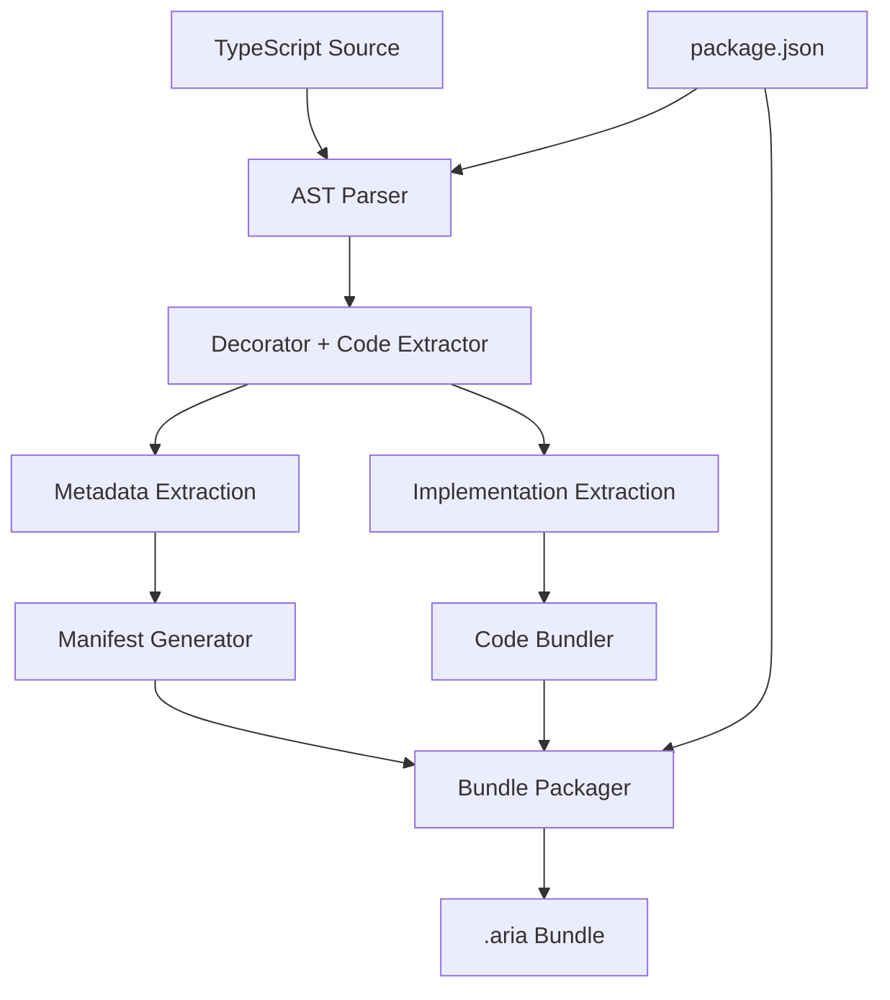

# Arc Compiler: Design & Implementation


Arc (Aria Compiler) is a TypeScript AST parser and bundle generator that transforms decorator-based TypeScript into executable `.aria` bundles for the Aria Firmware. It extracts both decorator metadata and complete implementation code, creating bundles that enable seamless tool/agent registration with the runtime.

## 1. Overview & Architecture



### Core Responsibilities
- **Parse TypeScript AST** for decorator-based configurations
- **Extract decorator metadata** from `@aria`, `@tool`, `@agent`, `@team` decorators
- **Extract complete implementations** (functions, classes, methods) with full scope preservation
- **Generate manifest.json** with essential metadata for runtime registration
- **Bundle executable code** with proper module structure for container execution
- **Resolve dependencies** from package.json for Bun runtime

## 2. Dual Extraction Strategy

### 2.1 Decorator Targets & Implementation Capture

```typescript
// Input: Decorated TypeScript
@tool({
  name: "authenticateUser",
  description: "Verify user credentials against database",
  inputs: { username: "string", password: "string" },
  outputs: { success: "boolean", userId?: "string", error?: "string" }
})
async authenticateUser(params: { username: string, password: string }) {
  const user = await database.users.findOne({ username: params.username })
  if (!user || !await bcrypt.compare(params.password, user.hashedPassword)) {
    return { success: false, error: "Invalid credentials" }
  }
  return { success: true, userId: user.id }
}

// Arc Extraction:
// 1. Metadata → { name: "authenticateUser", description: "...", inputs: {...}, outputs: {...} }
// 2. Implementation → Complete function with dependencies, imports, scope
```

### 2.2 Implementation Extraction Requirements

The AST parser must robustly extract:
- **Complete function bodies** with all logic, variables, closures
- **Dependency imports** used within the function
- **Scope preservation** for variables, constants, helper functions
- **Async/await patterns** and promise handling
- **Error handling** and try/catch blocks
- **Type annotations** and runtime type checking
- **Class methods** with proper `this` binding and property access

## 3. AST Parsing Implementation

### 3.1 Enhanced Parser Architecture

```typescript
interface AriaCompiler {
  // Main compilation pipeline
  compile(sourceFiles: string[], outputDir: string): Promise<CompilationResult>
  
  // Core extraction components
  parseDecorators(sourceFile: SourceFile): DecoratorTarget[]
  extractMetadata(target: DecoratorTarget): DecoratorMetadata
  extractImplementation(target: DecoratorTarget): ImplementationCode
  generateManifest(metadata: DecoratorMetadata[]): ManifestSchema
  bundleImplementations(implementations: ImplementationCode[]): CodeBundle
}

interface DecoratorTarget {
  type: 'aria' | 'tool' | 'agent' | 'team'
  decorator: Decorator
  node: FunctionDeclaration | MethodDeclaration | ClassDeclaration
  metadata: Record<string, any>
  sourceLocation: SourceLocation
}

interface ImplementationCode {
  name: string
  type: 'function' | 'class' | 'method'
  sourceCode: string
  dependencies: ImportStatement[]
  exports: ExportStatement[]
  scope: ScopeContext
}

interface ScopeContext {
  imports: string[]
  variables: string[]
  functions: string[]
  types: string[]
}
```

### 3.2 Robust Implementation Extraction

```typescript
class ImplementationExtractor {
  extractFunction(node: FunctionDeclaration | MethodDeclaration): ImplementationCode {
    // Extract complete function with full context
    const implementation = {
      name: this.getFunctionName(node),
      type: 'function' as const,
      sourceCode: this.getFullFunctionText(node),
      dependencies: this.extractDependencies(node),
      exports: this.extractExports(node),
      scope: this.analyzeScopeContext(node)
    }
    
    // Validate implementation completeness
    this.validateImplementation(implementation)
    
    return implementation
  }
  
  private getFullFunctionText(node: FunctionDeclaration | MethodDeclaration): string {
    // Get complete function text including:
    // - Function signature with types
    // - Full body with all statements
    // - Async/await keywords
    // - JSDoc comments if present
    
    const sourceFile = node.getSourceFile()
    const start = node.getFullStart()  // Include leading trivia (comments)
    const end = node.getEnd()
    
    return sourceFile.text.substring(start, end)
  }
  
  private extractDependencies(node: Node): ImportStatement[] {
    const dependencies: ImportStatement[] = []
    const sourceFile = node.getSourceFile()
    
    // Extract all imports used by this function
    const usedIdentifiers = this.findUsedIdentifiers(node)
    
    sourceFile.statements
      .filter(stmt => ts.isImportDeclaration(stmt))
      .forEach(importStmt => {
        const importClause = importStmt.importClause
        if (importClause && this.isImportUsed(importClause, usedIdentifiers)) {
          dependencies.push({
            statement: importStmt.getText(sourceFile),
            module: this.getModuleName(importStmt),
            imports: this.getImportNames(importClause)
          })
        }
      })
    
    return dependencies
  }
  
  private analyzeScopeContext(node: Node): ScopeContext {
    // Analyze what's in scope for this function:
    // - Module-level variables/constants
    // - Imported functions/types
    // - Helper functions defined in same file
    // - Class properties (if method)
    
    return {
      imports: this.getAvailableImports(node),
      variables: this.getAccessibleVariables(node),
      functions: this.getAccessibleFunctions(node),
      types: this.getAccessibleTypes(node)
    }
  }
  
  private validateImplementation(impl: ImplementationCode): void {
    // Ensure implementation is complete and executable:
    // - All referenced identifiers are available
    // - No missing imports
    // - Function is syntactically valid
    // - Async patterns are preserved
    
    const issues = []
    
    if (!this.hasValidSyntax(impl.sourceCode)) {
      issues.push("Invalid syntax in extracted function")
    }
    
    if (!this.allDependenciesResolved(impl)) {
      issues.push("Missing dependencies for function execution")
    }
    
    if (issues.length > 0) {
      throw new Error(`Implementation extraction failed: ${issues.join(', ')}`)
    }
  }
}
```

### 3.3 Class & Method Extraction

```typescript
class ClassExtractor {
  extractAgentClass(node: ClassDeclaration): ImplementationCode {
    // Extract complete class with all methods, properties, constructor
    const classText = this.getCompleteClassText(node)
    
    return {
      name: node.name?.getText() || 'UnnamedClass',
      type: 'class',
      sourceCode: classText,
      dependencies: this.extractClassDependencies(node),
      exports: this.extractClassExports(node),
      scope: this.analyzeClassScope(node)
    }
  }
  
  private getCompleteClassText(node: ClassDeclaration): string {
    // Include:
    // - Class decorators
    // - Constructor with parameters
    // - All methods (decorated and undecorated)
    // - Properties and fields
    // - Access modifiers (private, protected, public)
    // - Static members
    
    const sourceFile = node.getSourceFile()
    let classStart = node.getFullStart()
    let classEnd = node.getEnd()
    
    // Extend to include any associated helper functions or constants
    // that are used by this class
    const extendedScope = this.findAssociatedCode(node)
    if (extendedScope.length > 0) {
      classStart = Math.min(classStart, ...extendedScope.map(n => n.getStart()))
      classEnd = Math.max(classEnd, ...extendedScope.map(n => n.getEnd()))
    }
    
    return sourceFile.text.substring(classStart, classEnd)
  }
}
```

## 4. Bundle Structure & Code Organization

### 4.1 Enhanced .aria Bundle Format

```
myapp.aria
├── manifest.json              # Decorator metadata for runtime
├── implementations/           # Complete executable code
│   ├── tools/
│   │   ├── authenticateUser.ts   # Full function implementation
│   │   ├── searchDatabase.ts     # With dependencies preserved
│   │   └── validateInput.ts
│   ├── agents/
│   │   ├── UserAssistant.ts      # Complete class with methods
│   │   └── TechnicalSupport.ts
│   ├── teams/
│   │   └── SupportTeam.ts
│   └── shared/                   # Common utilities/helpers
│       ├── database.ts
│       ├── auth.ts
│       └── utils.ts
├── package.json               # Runtime dependencies
└── metadata/
    ├── tokens.json           # Resource tokens
    ├── dependencies.json     # Code dependency graph
    └── build.json           # Build metadata
```

### 4.2 Code Bundle Generator

```typescript
class CodeBundler {
  async bundleImplementations(
    implementations: ImplementationCode[],
    manifest: AriaManifest
  ): Promise<CodeBundle> {
    const bundle = new CodeBundle()
    
    for (const impl of implementations) {
      // Create standalone executable file for each implementation
      const executableCode = await this.createExecutableCode(impl)
      
      // Organize by type
      const directory = this.getTargetDirectory(impl.type)
      const filename = `${impl.name}.ts`
      
      await bundle.addFile(`implementations/${directory}/${filename}`, executableCode)
    }
    
    // Add shared dependencies
    const sharedCode = await this.extractSharedDependencies(implementations)
    for (const [filename, code] of sharedCode.entries()) {
      await bundle.addFile(`implementations/shared/${filename}`, code)
    }
    
    return bundle
  }
  
  private async createExecutableCode(impl: ImplementationCode): Promise<string> {
    // Create a complete, standalone file that can be executed
    const imports = impl.dependencies.map(dep => dep.statement).join('\n')
    const exports = `export { ${impl.name} }`
    
    return `${imports}\n\n${impl.sourceCode}\n\n${exports}`
  }
  
  private extractSharedDependencies(implementations: ImplementationCode[]): Map<string, string> {
    // Find common dependencies used across multiple implementations
    // Extract them to shared/ directory to avoid duplication
    
    const dependencyUsage = new Map<string, ImplementationCode[]>()
    
    // Analyze dependency patterns
    implementations.forEach(impl => {
      impl.dependencies.forEach(dep => {
        if (!dependencyUsage.has(dep.module)) {
          dependencyUsage.set(dep.module, [])
        }
        dependencyUsage.get(dep.module)!.push(impl)
      })
    })
    
    // Extract shared utilities
    const sharedCode = new Map<string, string>()
    dependencyUsage.forEach((users, moduleName) => {
      if (users.length > 1 && this.isLocalModule(moduleName)) {
        const moduleCode = this.extractModuleCode(moduleName)
        sharedCode.set(`${moduleName}.ts`, moduleCode)
      }
    })
    
    return sharedCode
  }
}
```

## 5. Runtime Integration & Registration

### 5.1 Runtime Bundle Loading

```typescript
// How Aria Runtime consumes the extracted implementations
class BundleLoader {
  async loadBundle(bundlePath: string): Promise<LoadedBundle> {
    const bundle = await AriaBundle.load(bundlePath)
    const manifest = await bundle.getManifest()
    
    // Load and register tools
    const tools = await this.loadTools(bundle, manifest.tools)
    
    // Load and instantiate agents
    const agents = await this.loadAgents(bundle, manifest.agents)
    
    // Load and form teams
    const teams = await this.loadTeams(bundle, manifest.teams)
    
    return { manifest, tools, agents, teams }
  }
  
  private async loadTools(bundle: AriaBundle, toolManifests: ToolManifest[]): Promise<Tool[]> {
    const tools: Tool[] = []
    
    for (const toolManifest of toolManifests) {
      // Check if tool already exists in registry
      if (!this.toolRegistry.has(toolManifest.name)) {
        // Load implementation from bundle
        const implPath = `implementations/tools/${toolManifest.name}.ts`
        const implCode = await bundle.getFile(implPath)
        
        // Create executable tool
        const tool = await this.createExecutableTool(toolManifest, implCode)
        
        // Register for future use
        this.toolRegistry.register(toolManifest.name, tool)
        
        tools.push(tool)
      } else {
        // Use existing registered tool
        tools.push(this.toolRegistry.get(toolManifest.name))
      }
    }
    
    return tools
  }
  
  private async createExecutableTool(manifest: ToolManifest, code: string): Promise<Tool> {
    // Execute the extracted code in Bun container to create callable tool
    const container = await this.containerManager.createToolContainer()
    
    // Install dependencies
    await container.installDependencies(manifest.dependencies)
    
    // Load and compile the implementation
    const toolFunction = await container.loadFunction(code, manifest.name)
    
    // Wrap with runtime features (validation, logging, etc.)
    return new ExecutableTool({
      name: manifest.name,
      description: manifest.description,
      inputs: manifest.inputs,
      outputs: manifest.outputs,
      handler: toolFunction,
      container: container
    })
  }
}
```

### 5.2 Magic Registration Process

```typescript
// The "magic" - seamless tool/agent availability across bundles
class RegistryManager {
  async processBundle(bundle: LoadedBundle): Promise<void> {
    // 1. Register all tools globally
    for (const tool of bundle.tools) {
      if (!this.globalToolRegistry.has(tool.name)) {
        this.globalToolRegistry.register(tool.name, tool)
        console.log(`✨ Registered new tool: ${tool.name}`)
      }
    }
    
    // 2. Register all agents globally  
    for (const agent of bundle.agents) {
      if (!this.globalAgentRegistry.has(agent.name)) {
        this.globalAgentRegistry.register(agent.name, agent)
        console.log(`✨ Registered new agent: ${agent.name}`)
      }
    }
    
    // 3. Make tools available to existing agents
    await this.updateExistingAgentCapabilities()
    
    // 4. Enable cross-bundle tool usage
    await this.enableCrossBundleUsage(bundle)
  }
  
  private async updateExistingAgentCapabilities(): Promise<void> {
    // When new tools are registered, update existing agents that could use them
    // This creates the "growing intelligence" effect
    
    for (const agent of this.globalAgentRegistry.values()) {
      const newTools = this.findRelevantTools(agent)
      if (newTools.length > 0) {
        await agent.expandCapabilities(newTools)
        console.log(`✨ Enhanced ${agent.name} with ${newTools.length} new tools`)
      }
    }
  }
}
```

## 6. CLI Interface

### 6.1 Commands

```bash
# Initialize new Aria project
arc new my-project --template=basic|advanced|team

# Build .aria bundle with implementation extraction
arc build [--output=dist] [--watch] [--verbose]

# Validate decorators and implementations
arc check [--strict] [--format=json|table]

# Upload to Aria Firmware
arc upload <bundle> --target=<firmware-url> [--auth=<token>]

# Package management
arc publish <bundle> --registry=<registry-url>
arc install <package> [--dev]
```

### 6.2 Build Process

```typescript
// arc build implementation
class ArcBuilder {
  async build(config: ArcConfig): Promise<void> {
    console.log('🔍 Parsing TypeScript AST...')
    const sourceFiles = await this.loadSourceFiles(config.entry)
    const program = this.createTypeScriptProgram(sourceFiles)
    
    console.log('🎯 Extracting decorated targets...')
    const targets = await this.extractDecoratorTargets(program)
    
    console.log('📦 Extracting implementations...')
    const implementations = await this.extractImplementations(targets)
    
    console.log('📋 Generating manifest...')
    const manifest = await this.generateManifest(targets, implementations)
    
    console.log('🔧 Bundling code...')
    const bundle = await this.createBundle(implementations, manifest, config)
    
    console.log('✨ Bundle created successfully!')
    console.log(`   Tools: ${implementations.filter(i => i.type === 'function').length}`)
    console.log(`   Agents: ${implementations.filter(i => i.type === 'class').length}`)
    console.log(`   Size: ${bundle.size} bytes`)
  }
}
```

## 7. Error Handling & Validation

### 7.1 Implementation Validation

```typescript
class ImplementationValidator {
  validateExtraction(impl: ImplementationCode): ValidationResult {
    const errors: ValidationError[] = []
    
    // Syntax validation
    if (!this.isValidTypeScript(impl.sourceCode)) {
      errors.push({
        type: 'error',
        message: 'Extracted code contains syntax errors',
        code: 'INVALID_SYNTAX'
      })
    }
    
    // Dependency validation
    const missingDeps = this.findMissingDependencies(impl)
    if (missingDeps.length > 0) {
      errors.push({
        type: 'error', 
        message: `Missing dependencies: ${missingDeps.join(', ')}`,
        code: 'MISSING_DEPENDENCIES'
      })
    }
    
    // Scope validation
    if (!this.validateScope(impl)) {
      errors.push({
        type: 'error',
        message: 'Function references unavailable variables or functions',
        code: 'SCOPE_ERROR'
      })
    }
    
    return { valid: errors.length === 0, errors }
  }
}
```

---

**The Magic**: Arc compiler seamlessly extracts both decorator metadata and complete implementation code, creating .aria bundles that enable the runtime to register tools/agents with full executable logic. The robust AST parsing ensures nothing is lost in translation - developers write decorated TypeScript, and the runtime gets complete, executable capabilities. 