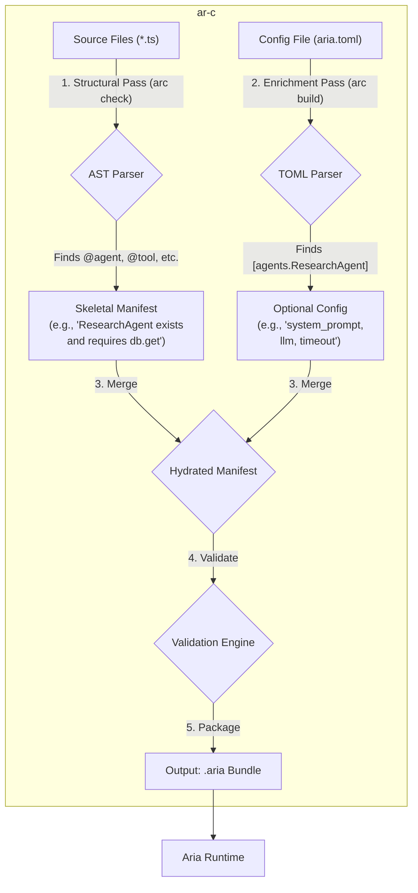

# `ar-c` Compiler Refactoring Plan

This document outlines the architectural plan to refactor the `ar-c` compiler. The goal is to move from a monolithic compilation process to a more efficient, maintainable, and robust two-pass system. This change supports our new developer experience model, which separates required, structural declarations (in code) from optional, tunable configurations (in `aria.toml`).

## 1. Executive Summary

The current CLI provides a solid foundation with distinct commands for `new`, `check`, and `build`. However, the core compilation logic is a monolithic process that needs to be refactored. The `arc new` command is already set up to use templates, which is excellent, but the templates themselves are outdated and need to be updated to reflect the new discoverable `aria.toml` philosophy. The `arc check` and `arc build` commands will be refactored to represent the two distinct passes of the new architecture.

## 2. Proposed Compiler Architecture: A Two-Pass System

The new architecture splits the compilation process into two distinct phases, creating a clear separation of concerns. The AST parser becomes responsible only for understanding the **structure and existence** of components, while a standard TOML parser handles the "enrichment" with optional parameters.

### Compiler Workflow Diagram

## 3. Detailed Implementation Plan

### 3.1. `arc new` (`crates/ar-c/src/cli/new.rs`)

The `arc new` command will be the entry point for the new developer experience.

-   **[KEEP]** The template-driven approach using `create_file_from_template` and `include_str!` is correct and will be preserved.
-   **[CHANGE]** The content of the `templates/aria.toml.template` file must be updated. It should become a comprehensive, discoverable guide to the Aria SDK by including **all possible optional fields for all components, commented out with descriptive comments**.
-   **[CLARIFY]** The `llm.xml` file should be preserved in the `arc new` template. Its purpose is for the end-user as a DX aid to provide context to an external LLM about the Aria SDK. It is not a configuration file for the compiler and will be ignored during the `check` and `build` steps.
-   **[REMOVE]** The `config/` directory creation can be removed as `package.json` should be at the root.

### 3.2. `arc check` (`crates/ar-c/src/cli/check.rs`)

The `arc check` command will be refactored to formally become the **"Structural Pass" (Pass 1)**.

-   **[KEEP]** The dedicated `check` command is the correct interface for developers to get fast feedback.
-   **[CHANGE]** The underlying implementation, `AriaCompiler::check_project`, must be modified to perform an AST-only scan.
-   **Responsibilities of `check_project`**:
    1.  Parse TypeScript files to find all `@agent`, `@tool`, `@pipeline`, etc. decorators.
    2.  Extract and validate only the *required* fields from decorators (e.g., `description`, `name`, `tools`).
    3.  Detect the usage of runtime system decorators (`@db.get`, `@task.launch`, etc.) to understand system requirements.
    4.  It must **not** read or parse `aria.toml`.
-   **Output**: A successful `arc check` will confirm that the project's code structure is valid from the Aria Framework's perspective.

### 3.3. `arc build` (`crates/ar-c/src/cli/build.rs`)

The `arc build` command will implement the full two-pass compilation, merge, and packaging process.

-   **[KEEP]** The existing `load_project_config` logic for finding and parsing `aria.toml` is robust and will be reused for the "Enrichment Pass".
-   **[CHANGE]** The `AriaCompiler::compile_project` function must be re-architected from a monolithic process into a multi-step pipeline:
    1.  **Execute Pass 1 (Structural):** The build process will begin by invoking the same logic as `arc check` to produce the "skeletal manifest" from the source code.
    2.  **Execute Pass 2 (Enrichment):** It will use the `load_project_config` function to parse `aria.toml` into a strongly-typed configuration struct.
    3.  **Merge & Hydrate:** It will iterate through the skeletal manifest and merge the optional parameters from the parsed TOML data. Sensible defaults will be applied for any unspecified optional values.
    4.  **Validate:** With the fully hydrated manifest, it will perform cross-cutting validation (e.g., ensure all tools listed in an agent's config are defined, check for orphaned configurations in TOML).
    5.  **Package:** Finally, it will serialize the validated, hydrated manifest and the transpiled source code into the final `.aria` bundle.

## 4. Architectural Benefits

This refactoring will yield significant long-term benefits:

-   **Efficiency:** Minimizes the use of expensive AST parsing and leverages fast, standard TOML parsing for the bulk of configuration, leading to faster build times.
-   **Maintainability:** Adding new optional parameters becomes trivial. It will only require a change to the TOML parsing struct and the runtime, with **no changes to the complex AST parser**.
-   **Robustness:** Cleanly separates the concerns of code *structure* from behavioral *tuning*, reducing the risk of complex bugs and making the compiler easier to reason about.
-   **Superior Developer Experience:** Provides the best of both worlds: essential structure is self-documented in the code, while all tuning knobs are in one easy-to-find and discoverable `aria.toml` file. 