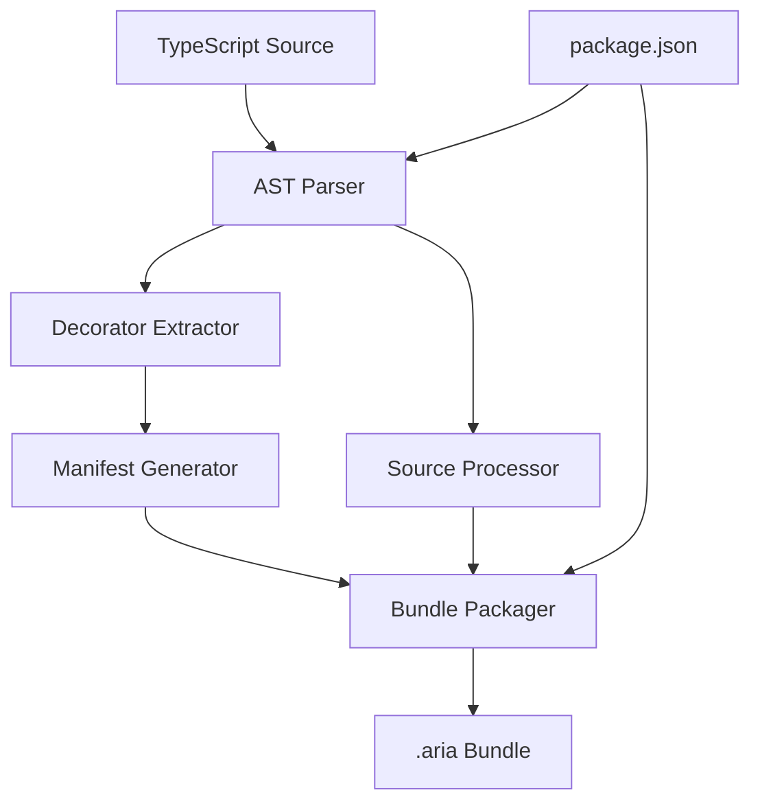

# Arc Compiler: Design & Implementation

Arc (Aria Compiler) is a TypeScript AST parser and bundle generator that transforms decorator-based TypeScript into executable `.aria` bundles for the Aria Firmware. It focuses on extracting essential configurations from decorators and generating optimized bundles with sensible defaults provided by the runtime.

## 1. Overview & Architecture



### Core Responsibilities
- **Parse TypeScript AST** for decorator-based configurations
- **Extract required fields** from `@aria`, `@tool`, `@agent`, `@team` decorators
- **Generate manifest.json** with essential metadata for runtime
- **Bundle source code** with dependencies for container execution
- **Resolve dependencies** from package.json for Bun runtime

## 2. Decorator Syntax & Parsing

### 2.1 Entry Point Decorator

```typescript
@aria({
  name: "UserManagement", 
  version: "1.0.0",
  description: "User authentication and management system"
})
export class UserManager {
  // Tools, agents, teams defined as methods
}
```

**Required Fields:**
- `name`: Bundle identifier
- `version`: Semantic version
- `description`: Human-readable description

### 2.2 Tool Decorators

```typescript
@tool({
  name: "authenticateUser",
  description: "Verify user credentials against database",
  inputs: {
    username: "string",
    password: "string"
  },
  outputs: {
    success: "boolean",
    userId?: "string",
    error?: "string"
  }
})
async authenticateUser(params: { username: string, password: string }) {
  // Implementation
}
```

**Required Fields:**
- `name`: Tool identifier
- `description`: Tool purpose (used by runtime for LLM prompts)
- `inputs`: Input parameter schema (JSON Schema format)
- `outputs`: Output schema (JSON Schema format)

**Optional Fields (runtime defaults):**
- `timeout`: 30000ms
- `retryCount`: 3
- `type`: "custom"

### 2.3 Agent Decorators

```typescript
@agent({
  name: "UserAssistant",
  description: "Helps users with account management and support",
  task: "Assist users with authentication, password resets, and account inquiries",
  tools: ["authenticateUser", "resetPassword", "fetchUserProfile"]
})
class UserAssistant {
  // Agent implementation
}
```

**Required Fields:**
- `name`: Agent identifier
- `description`: Agent capabilities and purpose
- `task`: Primary goal/responsibility
- `tools`: Array of tool names this agent can use

**Optional Fields (runtime defaults):**
- `llm`: "gpt-4o-mini"
- `maxCalls`: 10
- `timeout`: 300000ms

### 2.4 Team Decorators

```typescript
@team({
  name: "SupportTeam",
  description: "Customer support team with specialized roles",
  agents: ["UserAssistant", "TechnicalSupport", "EscalationAgent"]
})
class SupportTeam {
  // Team coordination logic
}
```

**Required Fields:**
- `name`: Team identifier
- `description`: Team purpose and coordination strategy
- `agents`: Array of agent names in the team

**Optional Fields (runtime defaults):**
- `strategy`: "adaptive-coordination"
- `maxParallelTasks`: 3

## 3. AST Parsing Implementation

### 3.1 Parser Architecture

```typescript
interface AriaCompiler {
  // Main compilation pipeline
  compile(sourceFiles: string[], outputDir: string): Promise<CompilationResult>
  
  // Core parsing components
  parseDecorators(sourceFile: SourceFile): DecoratorMetadata[]
  extractConfiguration(decorator: Decorator): ConfigurationBlock
  generateManifest(metadata: DecoratorMetadata[]): ManifestSchema
  bundleSource(sourceFiles: string[], manifest: ManifestSchema): AriaBundle
}

interface DecoratorMetadata {
  type: 'aria' | 'tool' | 'agent' | 'team'
  name: string
  config: Record<string, any>
  sourceLocation: SourceLocation
  dependencies: string[]
}

interface ConfigurationBlock {
  required: Record<string, any>
  optional: Record<string, any>
  validation: ValidationSchema
}
```

### 3.2 TypeScript AST Processing

```typescript
// Using TypeScript Compiler API
import { createProgram, SourceFile, Decorator, Node } from 'typescript'

class DecoratorParser {
  parseAriaDecorators(sourceFile: SourceFile): DecoratorMetadata[] {
    const decorators: DecoratorMetadata[] = []
    
    // Walk AST nodes
    sourceFile.forEachChild(node => {
      if (this.isDecoratedNode(node)) {
        const metadata = this.extractDecoratorMetadata(node)
        if (metadata) decorators.push(metadata)
      }
    })
    
    return decorators
  }
  
  private extractDecoratorMetadata(node: Node): DecoratorMetadata | null {
    const decorators = this.getDecorators(node)
    
    for (const decorator of decorators) {
      const name = this.getDecoratorName(decorator)
      
      if (['aria', 'tool', 'agent', 'team'].includes(name)) {
        return {
          type: name as DecoratorType,
          name: this.extractNameFromConfig(decorator),
          config: this.parseDecoratorConfig(decorator),
          sourceLocation: this.getSourceLocation(node),
          dependencies: this.extractDependencies(node)
        }
      }
    }
    
    return null
  }
}
```

## 4. Manifest Generation

### 4.1 Manifest Schema

```typescript
interface AriaManifest {
  // Bundle metadata
  name: string
  version: string
  description: string
  
  // Entry point
  entry: {
    class: string
    file: string
  }
  
  // Component definitions
  tools: ToolManifest[]
  agents: AgentManifest[]
  teams: TeamManifest[]
  
  // Runtime requirements
  dependencies: PackageDependency[]
  resourceTokens: ResourceToken[]
  
  // Metadata
  compiledAt: string
  arcVersion: string
  sourceFiles: string[]
}

interface ToolManifest {
  name: string
  description: string
  inputs: JSONSchema
  outputs: JSONSchema
  handler: {
    file: string
    method: string
  }
}

interface AgentManifest {
  name: string
  description: string
  task: string
  tools: string[]
  capabilities: string[]
}

interface TeamManifest {
  name: string
  description: string
  agents: string[]
  coordination: CoordinationStrategy
}
```

### 4.2 Resource Token Extraction

```typescript
class ResourceTokenExtractor {
  extractTokens(metadata: DecoratorMetadata[]): ResourceToken[] {
    const tokens: ResourceToken[] = []
    
    // Extract from tool I/O requirements
    for (const tool of metadata.filter(m => m.type === 'tool')) {
      tokens.push(...this.analyzeToolResources(tool))
    }
    
    // Extract from agent tool dependencies
    for (const agent of metadata.filter(m => m.type === 'agent')) {
      tokens.push(...this.analyzeAgentResources(agent))
    }
    
    return this.deduplicateTokens(tokens)
  }
  
  private analyzeToolResources(tool: DecoratorMetadata): ResourceToken[] {
    const tokens: ResourceToken[] = []
    
    // Analyze inputs/outputs for resource patterns
    if (this.requiresKVAccess(tool.config)) {
      tokens.push({ type: 'kv', scope: 'rw', resource: tool.name })
    }
    
    if (this.requiresNetworkAccess(tool.config)) {
      tokens.push({ type: 'net', scope: 'outbound', resource: 'external' })
    }
    
    if (this.requiresLLMAccess(tool.config)) {
      tokens.push({ type: 'llm', scope: 'inference', resource: 'default' })
    }
    
    return tokens
  }
}
```

## 5. Bundle Structure & Packaging

### 5.1 .aria Bundle Format

```
myapp.aria
├── manifest.json          # Auto-generated manifest
├── source/               # Processed TypeScript source
│   ├── index.ts         # Entry point
│   ├── tools/           # Tool implementations
│   ├── agents/          # Agent classes
│   └── teams/           # Team coordination
├── package.json         # Dependencies for Bun runtime
└── metadata/            # Compilation metadata
    ├── tokens.json      # Resource tokens
    ├── validation.json  # Schema validation
    └── build.json       # Build metadata
```

### 5.2 Bundle Packager

```typescript
class BundlePackager {
  async createBundle(
    sourceFiles: string[],
    manifest: AriaManifest,
    packageJson: PackageJson,
    outputPath: string
  ): Promise<void> {
    const bundle = new AriaBundle(outputPath)
    
    // Add manifest
    await bundle.addFile('manifest.json', JSON.stringify(manifest, null, 2))
    
    // Process and add source files
    for (const sourceFile of sourceFiles) {
      const processed = await this.processSourceFile(sourceFile)
      await bundle.addFile(`source/${path.basename(sourceFile)}`, processed)
    }
    
    // Add dependencies
    const filteredPackageJson = this.filterDependencies(packageJson, manifest.dependencies)
    await bundle.addFile('package.json', JSON.stringify(filteredPackageJson, null, 2))
    
    // Add metadata
    await bundle.addFile('metadata/tokens.json', JSON.stringify(manifest.resourceTokens))
    await bundle.addFile('metadata/build.json', JSON.stringify({
      compiledAt: new Date().toISOString(),
      arcVersion: this.version,
      sourceHash: this.calculateSourceHash(sourceFiles)
    }))
    
    await bundle.seal()
  }
}
```

## 6. CLI Interface

### 6.1 Commands

```bash
# Initialize new Aria project
arc new my-project --template=basic|advanced|team

# Build .aria bundle
arc build [--output=dist] [--watch] [--verbose]

# Validate without building
arc check [--strict] [--format=json|table]

# Upload to Aria Firmware
arc upload <bundle> --target=<firmware-url> [--auth=<token>]

# Package management
arc publish <bundle> --registry=<registry-url>
arc install <package> [--dev]
```

### 6.2 Configuration File

```typescript
// arc.config.ts
export default {
  entry: './src/index.ts',
  output: './dist',
  target: 'aria-firmware',
  
  // Bundling options
  minify: true,
  sourceMaps: true,
  
  // Validation
  strict: true,
  requireAllExports: false,
  
  // Dependencies
  external: ['@aria/runtime'],
  bundleDependencies: ['lodash', 'zod'],
  
  // Development
  watch: {
    include: ['src/**/*.ts'],
    exclude: ['node_modules']
  }
}
```

## 7. Integration with Aria Runtime

### 7.1 Runtime Consumption

The Aria Runtime consumes .aria bundles through:

1. **Manifest Processing**: Reads manifest.json to understand bundle structure
2. **Tool Registration**: Registers tools in global ToolRegistry
3. **Agent Creation**: Instantiates agents with default configurations
4. **Team Formation**: Creates team coordination structures
5. **Resource Allocation**: Requests tokens from Quilt based on manifest.resourceTokens
6. **Container Setup**: Installs dependencies via Bun in isolated containers

### 7.2 Execution Flow

```typescript
// Runtime bundle loading process
class BundleLoader {
  async loadBundle(bundlePath: string): Promise<LoadedBundle> {
    const bundle = await AriaBundle.load(bundlePath)
    const manifest = await bundle.getManifest()
    
    // Validate bundle integrity
    await this.validateBundle(bundle, manifest)
    
    // Install dependencies in container
    await this.setupContainer(manifest.dependencies)
    
    // Register components
    const tools = await this.registerTools(manifest.tools, bundle)
    const agents = await this.createAgents(manifest.agents, tools)
    const teams = await this.formTeams(manifest.teams, agents)
    
    return {
      manifest,
      tools,
      agents,
      teams,
      metadata: await bundle.getMetadata()
    }
  }
}
```

## 8. Development Workflow

### 8.1 Typical Development Flow

```bash
# 1. Create new project
arc new user-management --template=basic

# 2. Implement tools/agents with decorators
# Edit src/index.ts, add @tool, @agent decorators

# 3. Build and validate
arc check --strict
arc build --watch

# 4. Test locally (future: arc dev server)
arc upload dist/user-management.aria --target=localhost:7600

# 5. Deploy to production
arc upload dist/user-management.aria --target=prod.example.com
```

### 8.2 Template System

```
templates/
├── basic/              # Single-file tools and agents
├── advanced/           # Multi-file with teams and pipelines  
├── team-coordination/  # Complex multi-agent systems
└── microservice/      # Service-oriented architecture
```

## 9. Error Handling & Validation

### 9.1 Compile-Time Validation

```typescript
interface ValidationError {
  type: 'error' | 'warning'
  message: string
  file: string
  line: number
  column: number
  code: string
}

class AriaValidator {
  validateDecorators(metadata: DecoratorMetadata[]): ValidationError[] {
    const errors: ValidationError[] = []
    
    // Check required fields
    errors.push(...this.validateRequiredFields(metadata))
    
    // Check tool/agent references
    errors.push(...this.validateReferences(metadata))
    
    // Check resource token compatibility
    errors.push(...this.validateResourceTokens(metadata))
    
    // Check naming conflicts
    errors.push(...this.validateNaming(metadata))
    
    return errors
  }
}
```

## 10. Future Enhancements

### Phase 2 Features
- **Hot Reloading**: Live bundle updates without container restart
- **Advanced Types**: Integration with full Aria language type system
- **Optimization**: Dead code elimination and bundle size optimization
- **Debugging**: Source map support for runtime debugging
- **Testing**: Built-in test framework for tools and agents

### Phase 3 Features  
- **Visual Editor**: GUI for creating and managing decorators
- **Performance Profiling**: Bundle analysis and optimization suggestions
- **Multi-target**: Compile to different runtime targets (WebAssembly, etc.)
- **Plugin System**: Custom decorators and transformation plugins

---

Arc compiler provides the essential bridge between developer experience (decorators) and runtime execution (.aria bundles), focusing on simplicity and essential metadata extraction while letting the Aria Runtime handle sophisticated defaults and optimizations. 